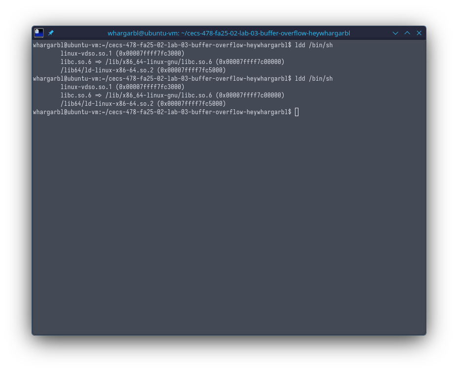
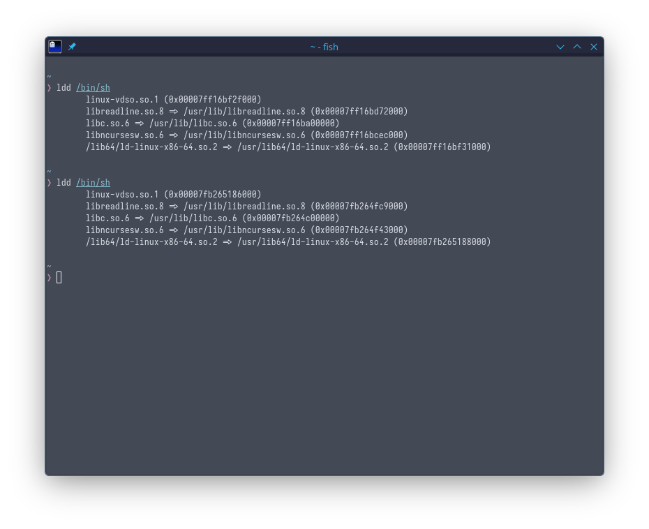

# resources
- [Aleph One - Smashing The Stack For Fun and Profit](https://phrack.org/issues/49/14#article)
- [Smashing the Stack in the 21st Century](https://thesquareplanet.com/blog/smashing-the-stack-21st-century/#disabling-modern-defenses)

# checklist
## OS config
- disable address space local randomization (ASLR) temporarily 
  - we were asked to utilize an older Linux kernel (2.4)
  - this is because ASLR was enabled on kernels starting around 2005
	- `sysctl -w kernel.randomize_va_space=0` 
	  - `-w`: write key `kernel.randomize_va_space=0`
    - have to run with sudo, and will reset on next kernel boot

## compiler config
- compile vuln.c with following flags (on a modern sys)
    - `-fno-stack-protector`: disable stack canaries
        - learned a stack canary inserts a val between the local vars of a function
        and its next frame, the canary checks to see if this is still the 
         correct value, otherwise it doesn't execute the instruction
    - `-z execstack`: disable Write XOR execute
        - learned that all memory in the process is marked as ALL writeable
        or ALL executable. if shell code is injected into this space, it 
        won't execute because it isn't marked as executable
    - `-D_FORTIFY_SOURCE=0`: source foritifcation disable
        - learned that the compiler will wrap problematic functions with security
        checks if gcc knows the required bounds of the function
          - ex: `strcpy`

# initial config
## mutable versus immutable distros
One of the first things I wanted to try out was an immutable linux distro.
I decided to try out an atomic distro - Fedora Silverblue. One of the reasons 
I wanted to try this was because I was aware that I could layer distrobox and 
attempt to install older versions of linux. That process was pretty simple,
I just ran `rpm-ostree install distrobox` rebooted and went through distrobox
cli to create an Ubuntu 18 container.

However, it's too tightly integrated with the Host distro's processes and I 
couldn't disable ASLR because Silverblue prevents me from doing so! I didn't
want to spend too much more time on trying to figure this out, so I'll revisit
it later to see if I can getr it working. Instead, I went ahead and fired up my
Ubuntu 24.04 vm. Afterwards, I performed the setup I indicated above on my 
checklist. 

## verifying that ASLR was turned off
To verify that I had ASLR turned off I ran `ldd /bin/sh`. `ldd` lists the dynamic
dependencies of a given program. Running `ldd /bin/sh` on my desktop box shows:

Note the addresses for the libraries, they change on each run of `sh`. However, with ASLR OFF:

Each subsequent run of `sh` shows that its dependencies are loading in the same 
location.

# notes while working
## 64 bit asm
- %rsp is the stack pointer
- %rbp is the frame pointer (base pointer)
## what is vuln.c doing?
1. vuln reads from input `badfile` then passes it to `dummy_function()`
  - the original input has a char length of 517
2. dummy function inserts a stack frame of size 1000 between `main` and `bof`, then 
passes str to `bof`
3. `bof` `strcpy` from `str` to `buffer`, but the size of this is only 100 chars

this means that I need to create a breakpoint at bof

kept passing in strings of A, at 111 chars i get a segfault

inserted a string of chars 150 chars long:
`AAAABBBBCCCCDDDDEEEEFFFFGGGGHHHHIIIIJJJJKKKKLLLLMMMMNNNNOOOOPPPPQQQQRRRRSSSSTTTTUUUUVVVVWWWWXXXXYYYYZZZZ111122223333444455556666777788889999BBBBaaaaA`
using gdb, i checked rip, rip shows `rip            0x555555555252      0x555555555252 <bof+41>`
- something is still there, maybe didn't overwrite

using gdb next checked rbp
`(gdb) info registers rbp 
rbp            0x3434343433333333  0x3434343433333333`
- i have pattern of 34, 33 -- little endian so that looks like it falls in my 3 and 4 string, calculating, 3 overwrote rdb at begin of seq so 112, +8 is rip offset

inserted into badfile 110 chars of ABCD
start: 0x7fffffffdac0 (3500 decimal)
end: 0x7fffffffdb2e

is RIP at 0x7fffffffdb38? i'm inspecting %RSP

FUUUUUCCKKKKKKKK
